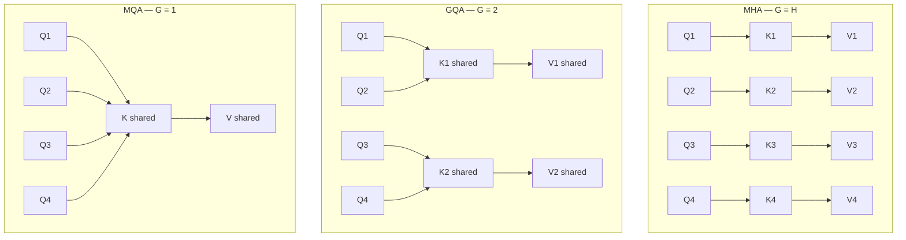

# Lista 11 — GQA: Grouped Query Attention

**Źródło:** Ainslie et al., *GQA: Training Generalized Multi-Query Transformer Models from Multi-Head Checkpoints*, EMNLP 2023.
https://arxiv.org/abs/2305.13245

---

## 1. Cel

Standardowy Multi-Head Attention (MHA) posiada niezależne projekcje K i V dla każdej głowicy, co przy dużych modelach generuje ogromny koszt pamięciowy. GQA redukuje liczbę zestawów K,V przez dzielenie ich między grupy głowic Q.

**Cel eksperymentu:** zbadać, czy GQA przynosi korzyści w klasyfikacji tekstu z enkoderem — czy redukowanie liczby głowic K,V zmienia accuracy i rozmiar modelu, i jak duży G można zastosować bez zauważalnej straty jakości.

---

## 2. Tło teoretyczne

### Jak działa self-attention

Każdy token produkuje trzy wektory: **Query** (co szukam), **Key** (czym jestem dla innych), **Value** (co przekazuję). Uwaga to `softmax(Q × K^T / sqrt(d_k)) × V`.

### MHA → MQA → GQA




**Q zawsze jest niezależne** dla każdej głowicy — każda zadaje inne pytanie. K i V są dzielone wewnątrz grupy. Redukcja parametrów jest dokładnie proporcjonalna do G/H.

---

## 3. Ograniczenia — dlaczego nie KV cache

Główna motywacja GQA w literaturze to **KV cache** — przy autoregresywnym generowaniu model przechowuje K i V dla wszystkich poprzednich tokenów. Przy H głowicach koszt pamięciowy to `2 × H × L × d_k`.

W tym eksperymencie używamy **enkodera klasyfikacyjnego** — cała sekwencja jest przetwarzana równolegle w jednym forward passie. KV cache nie jest tworzony.

Obserwowany tradeoff to zatem:

- ✅ **mierzalne:** mniej parametrów, mniejsze zużycie RAM
- ❌ **niemierzalne:** przyspieszenie inferencji (GPU liczy wszystkie głowice równolegle, różnica w transferze wag jest marginalna przy małym modelu)

---

## 4. GQA w klasyfikacji — ulepszenia

Naiwne GQA (sąsiednie głowice w równe grupy) jest suboptymalne. Prace po 2023 roku pokazują że mądrzejsze grupowanie poprawia jakość przy tym samym rozmiarze modelu:

**AsymGQA** (Chen et al., ICML 2024) — grupuje głowice według podobieństwa aktywacji zamiast pozycji. Wynik: +7.5% accuracy na MMLU vs. naiwne GQA przy tym samym rozmiarze modelu.

**DGQA** (Khan et al., 2024) — dynamicznie przydziela głowice Q do grup na podstawie norm głowic K w trakcie treningu. Testowane na **ViT dla klasyfikacji obrazów** (CIFAR-10, CIFAR-100): +8% accuracy vs. naiwne GQA na ViT-L.

**WGQA** (Chinnakonduru et al., 2024) — zamiast zwykłego uśredniania głowic K,V przy konwersji z MHA, używa wyuczonych wag. Poprawia o 0.53% nad GQA bez kosztu przy inferencji.

> Wynik DGQA na CIFAR-10 jest kluczowy — potwierdza że GQA w klasyfikacji jest otwartym problemem, a naiwne grupowanie to dolna granica możliwości.

---

## 5. Planowane eksperymenty

### Baseline

Model z lab 10: 3 × TransformerEncoderLayer (H=8), positional embedding, token [CLS], IMDB sentiment classification.

---

### Eksperyment 1 — różne wartości G

Porównanie MHA vs GQA dla G ∈ {1, 2, 4, 8}.

| Co mierzę          | Jak mierzę                                    |
| ------------------- | ---------------------------------------------- |
| Accuracy (test set) | standardowa klasyfikacja                       |
| Liczba parametrów  | `sum(p.numel() for p in model.parameters())` |
| Zużycie RAM        | `torch.cuda.memory_allocated()`              |

Każdy wariant powtórzony z 3 seedami. Główny wynik: krzywa accuracy vs G.

---

### Eksperyment 2 — strategia grupowania

Przy G=2 (4 głowice w 2 grupach) porównanie różnych sposobów przydziału głowic:

| Strategia           | Grupy                        |
| ------------------- | ---------------------------- |
| Naiwna (sąsiednie) | {Q1,Q2} → K1, {Q3,Q4} → K2 |
| Losowa              | {Q1,Q3} → K1, {Q2,Q4} → K2 |
| Odwrotna            | {Q1,Q4} → K1, {Q2,Q3} → K2 |

Jeśli accuracy różni się między strategiami — które głowice grupujemy razem ma znaczenie (potwierdzenie obserwacji z AsymGQA).

---

### Eksperyment 3 — długość sekwencji

Hipoteza: dłuższe sekwencje wymagają większej różnorodności K,V, więc GQA boli bardziej przy długich sekwencjach.

```
max_length ∈ {64, 128, 256, 512}  ×  G ∈ {1, 2, 4, 8}
```

Mierzę: accuracy dla każdej kombinacji. Spodziewam się że różnica MHA vs GQA rośnie z długością sekwencji.

---

### Eksperyment 4 — layer-wise GQA

Zamiast redukować wszystkie warstwy jednakowo, GQA tylko w wybranych warstwach:

| Wariant   | Warstwy       |
| --------- | ------------- |
| All-MHA   | MHA, MHA, MHA |
| Last-GQA  | MHA, MHA, GQA |
| Mid-GQA   | MHA, GQA, MHA |
| First-GQA | GQA, MHA, MHA |
| All-GQA   | GQA, GQA, GQA |

Pytanie: czy ostatnia warstwa (bezpośrednio przed klasyfikacją) jest bardziej wrażliwa na redukcję K,V niż pierwsza?

---

### Eksperyment 5 — krzywa zbieżności

Dla każdej wartości G rysować accuracy na zbiorze testowym po każdej epoce. Sprawdzić czy GQA:

- zbiega wolniej ale dobija do tej samej końcowej accuracy
- czy od razu odbiega od MHA i zostaje niżej

Mierzę: `test_accuracy` po każdej epoce przez 20–30 epok dla G ∈ {1, 2, 4, 8}.
